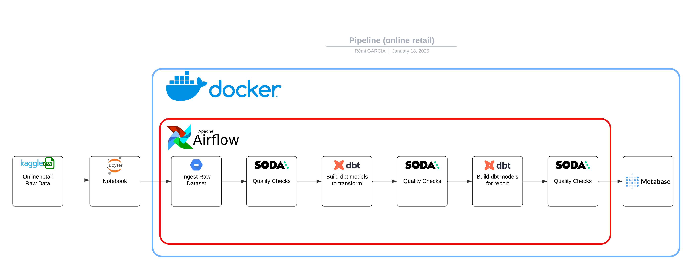
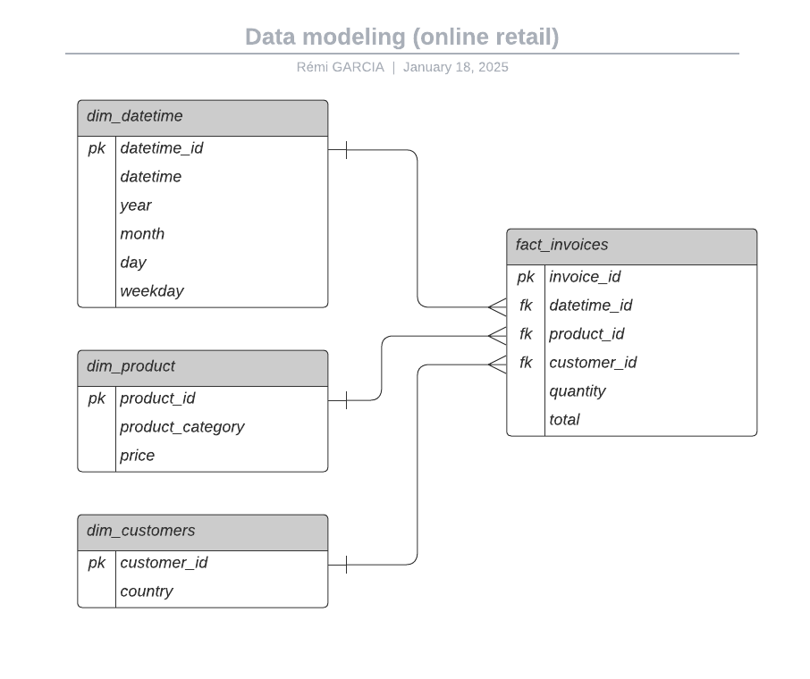

# Online retail pipeline

## Description

Le projet Online Retail Pipeline est un pipeline de données conçu pour traiter les transactions de vente en ligne. 
Il met en œuvre un processus ETL (Extraction, Transformation, Chargement) permettant de préparer les données brutes pour l'analyse et la visualisation. 
Ce pipeline est idéal pour les entreprises souhaitant analyser leurs données de ventes afin de mieux comprendre leurs performances et comportements clients.

## Objectifs

- Automatiser le traitement des données de transactions de vente en ligne.
- Nettoyer et transformer les données pour les rendre prêtes à l'analyse.
- Charger les données transformées dans une base de données ou un système de stockage adapté pour des analyses avancées.
- Orchestrer les processus avec Apache Airflow
- Faire des quality checks avec Soda.io
- Obtenir un tableau de bord avec Metabase

## Table des matières

- [Data Pipeline](#data-pipeline)
- [Data Modeling](#data-modeling)

## Data Pipeline

## Data Modeling

